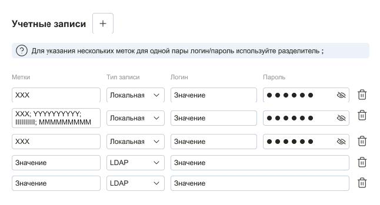

# SaaSoftTest



Стек:
1. Vue.js 3 + Composition API (фреймворк)
2. TypeScript (язык)
3. Pinia (стейт менеджер)
4. Любой UI фреймворк на выбор.


Форма состоит из:
1. Заголовка и кнопки добавления учетной записи.
2. Подсказки для поля метка.
3. Списка учетных записей с лейблами полей.


Учетная запись состоит из:
1. Метка - Необязательное поле к заполнению. Максимум 50 символов. В поле вводятся текстовые метки, через знак ;
2. Тип записи - Выпадающий список. Допускаются выборы из заранее предопределенных вариантов:
    - __LDAP__ - При выборе этого типа - поле __"Пароль"__ скрывается и сохраняется как null
    - __Локальная__ - При выборе этого типа - поле __"Пароль"__ показывается и сохраняется как введенное значение
3. Логин - Обязательное к заполнению. Максимум 100 символов
4. __Пароль__ - Обязательное к заполнению. Отображается в случае выбора значения __"Локальная"__ в поле __"Тип записи"__. Максимум 100 символов
5. Кнопки удаления учетной записи.


Логика работы формы:
1. По нажатию кнопки "+" в конец списка учетных записей, добавляется новая пустая запись, __состоящая из: Метки, Типа записи, Логина, Пароля.__
2. При нажатии кнопки удаления, учетная запись должна полностью удалиться.
3. По окончанию ввода значений в поля учетной записи (для текстовых - потеря фокуса, для селекта - изменение значения), происходит валидация обязательных полей. В случае валидности - учетная запись сохраняется/обновляется, в обратном, поля обозначаются красной обводкой.
4. Все поля сохраняются в текстовом виде, кроме поле Метка. Оно должно преобразовываться в массив, где один элемент это строковое значение до ;. В массиве должен лежать объект, где поле text равно одному элементу метки - ({ text: элемент метки })
5. Сохранение учетной записи должно происходить в стейт менеджер. При обновлении страницы, сохраненные учетные записи должны отображаться.

### Review Comment
1. Нет обработки ошибок при чтении из LS
2. Использование литералов вместо констант
3. Нарушение SOLID, валидацию и форматирование нужно отделять от представления
4. localStorage нужно выносить в хук, сейчас напрямую из компонента используется


## Project Setup

```sh
npm install
```

### Compile and Hot-Reload for Development

```sh
npm run dev
```

### Type-Check, Compile and Minify for Production

```sh
npm run build
```
